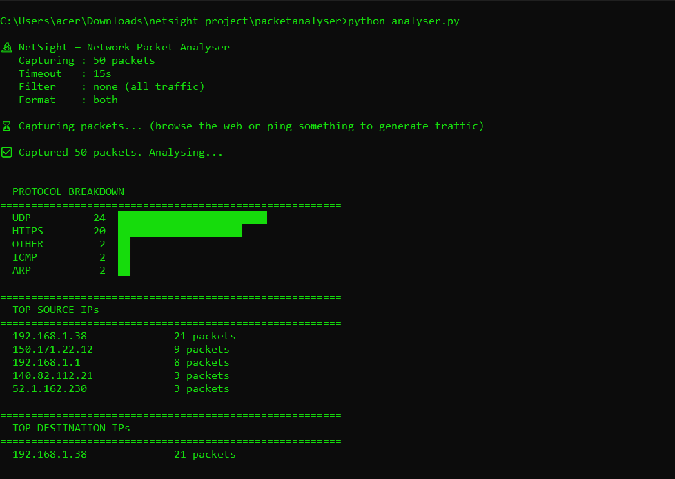

# 🔬 NetSight — Network Packet Analyser

A Python-based CLI tool that captures live network packets, classifies them by protocol, and generates a detailed HTML dashboard and JSON report.

Built as a portfolio project demonstrating **deep networking knowledge** relevant to Network QA / SD-WAN Test Engineering roles.

---

## 📸 Demo



---

## ⚡ Quick Start

```bash
# 1. Clone and install
git clone https://github.com/<your-username>/netsight
cd netsight
pip install -r requirements.txt

# 2. Run with default settings (capture 50 packets, 15s timeout)
# Windows: Run terminal as Administrator
# Linux/Mac: Run with sudo
python analyser.py

# 3. Capture more packets
python analyser.py --count 100 --timeout 30

# 4. Filter by protocol
python analyser.py --filter tcp
python analyser.py --filter udp
python analyser.py --filter icmp
python analyser.py --filter "port 443"

# 5. Choose report format
python analyser.py --format html
```

---

## 🧪 What It Analyses

| Feature | Details |
|---|---|
| Protocol classification | TCP, UDP, ICMP, HTTP, HTTPS, DNS, ARP, DHCP, SSH, FTP |
| Source & destination IPs | Top talkers on your network |
| Port analysis | Most active destination ports |
| Packet size stats | Average and total bytes captured |
| TCP flag detection | SYN, RST, FIN flags flagged in report |
| BPF filter support | Filter by protocol or port before capture |

---

## 📊 Sample Output

```
🔬 NetSight — Network Packet Analyser
   Capturing : 50 packets
   Timeout   : 15s
   Filter    : none (all traffic)

✅ Captured 50 packets. Analysing...

=======================================================
  PROTOCOL BREAKDOWN
=======================================================
  HTTPS      28  ████████████████████████████
  TCP        10  ██████████
  DNS         7  ███████
  UDP         3  ███
  ICMP        2  ██

📄 JSON report → reports/netsight_20250410_143022.json
🌐 HTML report → reports/netsight_20250410_143022.html
```

---

## 🔧 Tech Stack

- **Python 3.10+**
- `scapy` — packet capture and dissection
- HTML report with dark theme dashboard

---

## 📁 Project Structure

```
netsight/
├── analyser.py            # Main CLI entry point
├── requirements.txt
├── core/
│   ├── capture.py         # Live packet sniffing via scapy
│   └── analyser.py        # Protocol classification & stats
└── reports/
    └── reporter.py        # HTML + JSON report generator
```

---

## 💡 Key Design Decisions

- **Protocol-aware classification** — goes beyond raw TCP/UDP to identify HTTP, HTTPS, DNS, SSH, DHCP by port
- **TCP flag detection** — SYN, RST, FIN flags are extracted and highlighted, useful for spotting port scans or connection issues
- **BPF filter support** — industry-standard Berkeley Packet Filter syntax, same as Wireshark and tcpdump
- **Dark HTML dashboard** — visual protocol breakdown with bar charts, IP tables, and per-packet detail

---

## 📌 Relevance to Network QA / SD-WAN Testing

| Skill Area | How this project demonstrates it |
|---|---|
| Networking (TCP/IP, UDP, ICMP) | Live packet capture and protocol classification |
| Security awareness | TCP flag detection, HTTPS vs HTTP identification |
| Python scripting | Full tool written in Python using scapy |
| Debugging mindset | Per-packet detail view for traffic analysis |
| Reporting | Structured HTML + JSON output |
